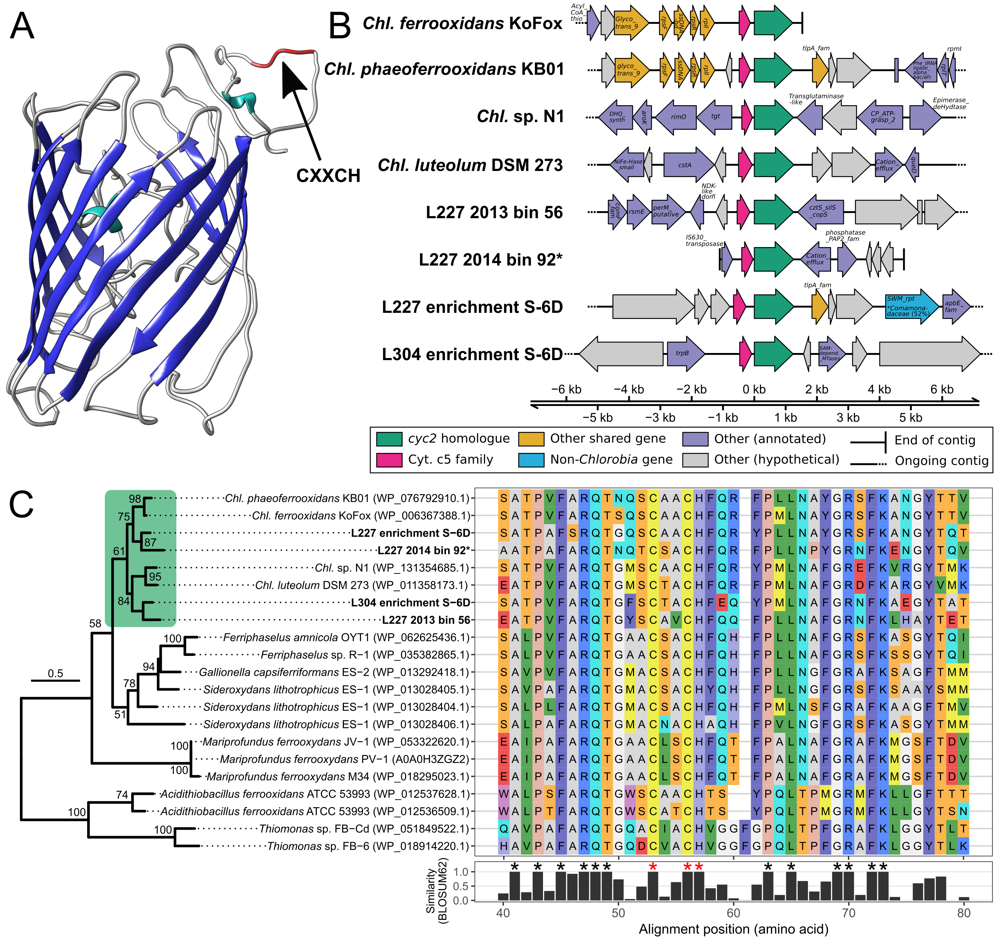

# ABOUT Figure 1 - cyc2 gene verification and novelty
Copyright Jackson M. Tsuji, Neufeld Research Group, 2019
Part of the larger *IISD-ELA Chlorobia cyc2 project*.

This figure is composed of three panels that were produced separately and then combined in Inkscape.

## Panel A - homlogy model of *cyc2* from *Chl. phaeoferrooxidans KB01
The homlogy model from I-TASSER (PDB file) was rendered as a PNG via Chimera (to make `C_phaeo_vs1.png`) and was then cropped in Inkscape to produce `C_phaeo_vs1_edit.png`.

## Panel B - gene neighbourhood analysis of *cyc2*
This panel was semi-automated but involved a fair amount of manual work.

### 1. Input files
The `input_files` directory in `panel_B` contains the data used to create the plot:
- `gff_subset_files` - folder with subsetted GFF files giving the gene context around *cyc2* for each relevant *Chlorobia* genome. The GFF subsets were generated in `Data_analysis_pipeline/06_comparative_genomics/08_gff_subset` - see code there.
- `Chlorobia_cyc2_genome_info.tsv` - guide file linking GFF files and genome names to cyc2 accessions
- `Figure_1B_plotting_colours.tsv` - guide file for the colours in the final plot
- `Figure_1B_plotting_data_raw.tsv` - raw *cyc2*-centered GFFs output by the script (see below) for manual refinement
- `Figure_1B_plotting_data.tsv` - manually curated GFF information that was used for the final plot (see below)

### 2. Plotted the figure
Ran `plot/Figure_1B_plotter.R` in interactive mode (e.g., in RStudio) with the following settings to produce `input_files/Figure_1B_plotting_data_raw.tsv`. Note that you'll need to install all libraries loaded at the top of the script:
```R
######################################
## User variables
######################################
params <- list()
params$gff_summary_filename <- here::here("plot", "Figure_1B_plotting_data_raw.tsv")
params$plotting_colour_guide_filename <- here::here("input_data", "Figure_1B_plotting_colours_template.tsv")
params$pdf_filename <- here::here("plot", "Figure_1B_raw.pdf")
params$cyc2_info_filename <- here::here("input_data", "Chlorobia_cyc2_genome_info.tsv")
params$gff_directory <- here::here("input_data", "gff_subset_files")
params$threads <- 4
params$buffer_length <- 5000
params$run_mode <- "auto"
######################################
```
From here, `input_files/Figure_1B_plotting_data_raw.tsv` had to be manually checked for accuracy. Although not shown in the repo, I went back and mined ORF prediction files corresponding to the GFFs to get the protein sequences of each entry, and I then ran those through BLASTP online. Each entry was checked for the annotation and taxonomic affiliation of its closest representatives, allowing for the annotation colours and abbreviations in the final plot. Generally, I followed the following protocol:
- Labelled a protein as 'Other (annotated)' if its closest BLASTP hit was to another member of *Chlorobia* with > 50% sequence identity, and the hit was annotated as a protein of known function.
- Labelled a protein "Other shared gene" if it matched all of the above criteria plus was related to another protein in the figure
- Labelled a protein 'Other (hypotheticl)' if it hit *Chlorobia* with > 50% sequence identity as above but the hit protein had unknown function, OR if the closest database hit was < 50% sequence identity (regardless of its taxonomy/annotation)
- Labelled a protein as a "Non-Chlorobia gene" if it had a hit of >50% sequence identity to a non-*Chlorobia* sequence.

Once done, the manually curated `input_files/Figure_1B_plotting_data.tsv`, along with the corresponding `input_data/Figure_1B_plotting_colours.tsv` were fed into `plot/Figure_1B_plotter.R` with alternative settings for producing the final plot:
```R
######################################
## User variables
######################################
params <- list()
params$gff_summary_filename <- here::here("plot", "Figure_1B_plotting_data.tsv")
params$plotting_colour_guide_filename <- here::here("input_data", "Figure_1B_plotting_colours.tsv")
params$pdf_filename <- here::here("plot", "Figure_1B_raw.pdf")
params$cyc2_info_filename <- NA
params$gff_directory <- NA
params$threads <- 4
params$buffer_length <- NA
params$run_mode <- "normal"
######################################
```

The output plot (`plot/Figure_1B_raw.pdf`) was still lacking several details that had to be added manually:
- lengths of contigs
- short form abbreviations for each gene
- legend

Once added, this resulted in `Figure_1B_cleaned.pdf`.


See R package versions in `R_session_info.log`. Log was generated after running the above script by:
```R
sink("R_session_info.log")
sessionInfo()
sink()
```

## Panel C - MSA and phylogeny of *cyc2*
This plot was mostly automated.

### 1. Input files
The `input_files` directory in `panel_C` contains the data used to create the plot:
- `cyc2_seqs_all_aligned.faa` - unmasked alignment of the *cyc2* predicted primary sequences, as generated in `Data_analysis_pipeline/04_HMM_development/02_alignment`
- `cyc2_phylogeny.treefile` - Cyc2 phylogeny, as generated in `Data_analysis_pipeline/06_comparative_genomics/02_cyc2_phylogeny`
- `cyc2_plotting_name_info.tsv` - guide file for the final names to be used in the plot
- `residue_colours_rasmol.tsv` - guide file for amino acid colours. I used a colour scheme widely availble online attributed to [RasMol](http://www.openrasmol.org/doc/), an open-source molecular visualization tool. Thanks, RasMol.

### 2. Plotted the figure
Ran `plot/Figure_1B_plotter.R` in interactive mode (e.g., in RStudio) to produce `plot/Figure_1C_raw.pdf`. Note that you'll need to install all libraries loaded at the top of the script. The output figure was then touched up a bit in Inkscape to produce the final panel, `plot/Figure_1C_cleaned.pdf`.

See R package versions in `R_session_info.log`. Log was generated after running the above script by:
```R
sink("R_session_info.log")
sessionInfo()
sink()
```

## Final figure
Each panel was combined to produce Figure 1:



