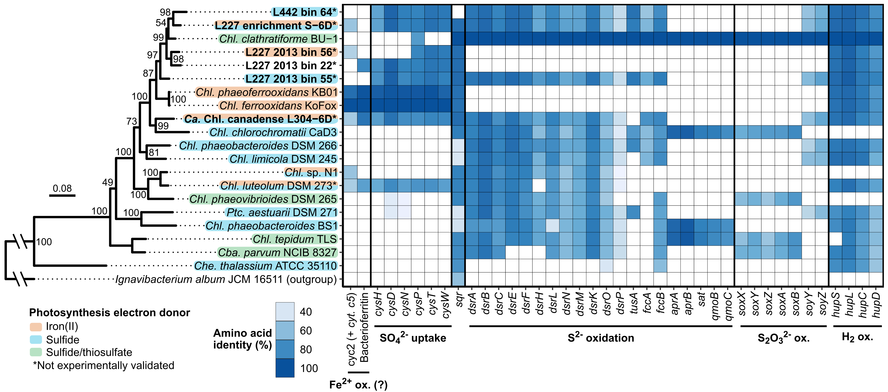

# ABOUT Figure 02 - Fe/S gene pathways among *Chlorobia*
Copyright Jackson M. Tsuji, Neufeld Research Group, 2019  
Part of the larger *IISD-ELA Chlorobia cyc2 project*.

The raw version of this plot was generated automatically using the BackBLAST pipeline (see `Data_analysis_pipeline/06_comparative_genomics/05_pathway_analysis/01_Fe_S_H2_genes`) and is included here as `Figure_02_raw.pdf`.

I then cleaned up the raw figure in Inkscape to make `Figure_02_cleaned.pdf`, the final figure:  

Note: During iterative testing of the e-value cutoffs, I realized that a few genes had very poor hit profiles on reference organisms. They might be unreliable genes for reciprocal BLAST comparison. I commented them out of the final gene table so that they were excluded from the final plot:
- _qmoA_
- _cysA_
- _cysG_
- _dsrT_
- _soxJ_ and _soxK_ -- N.B., _soxJ_ is a cytochrome
- _dsrJ_
- Also the four proteins with unknown function but possible roles in H2 and sulfite reduction; these are not as relevant to the paper.

