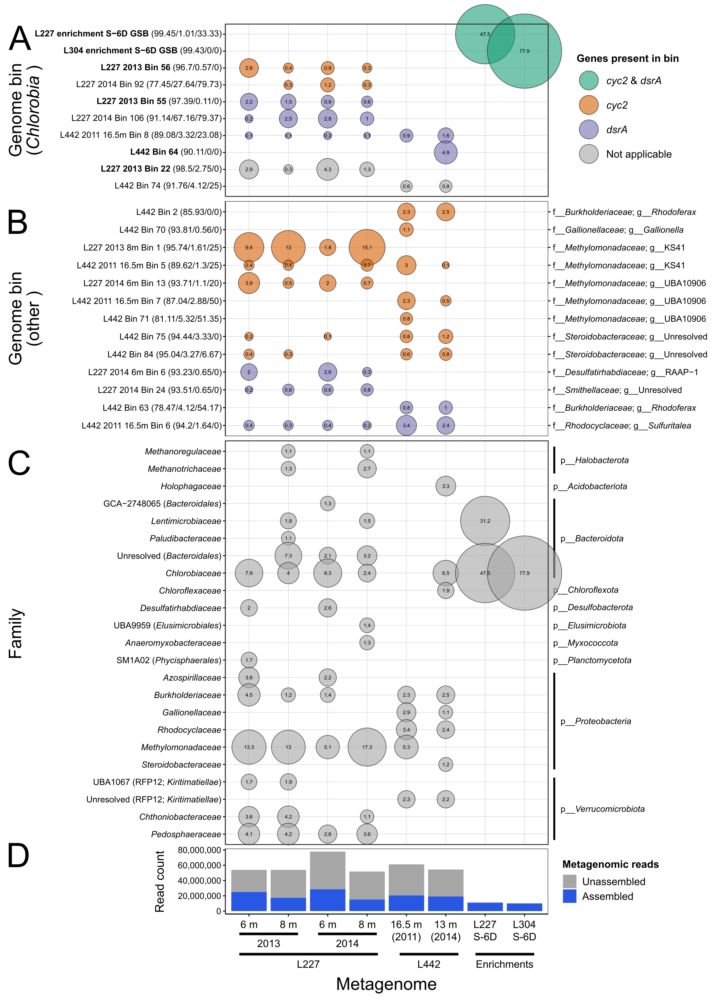

# ABOUT Figure 3 - environmental abundances of genome bins
Copyright Jackson M. Tsuji, Neufeld Research Group, 2019
Part of the larger *IISD-ELA Chlorobia cyc2 project*.

## 1. Data collection
All dereplicated genome bins from the lake and enrichment culture metagenomes were used as input, along with the quality-controlled raw metagenomic reads generated by ATLAS (see Assembly and Binning ABOUT files). The genome bin collection is available in `04_extra_files` in this repository. HMMs used for screening the metagenomes are also available in `04_extra_files` in this repository.

The `input_files` directory contains the data used to create the plot:
- `ELA111314_dRep_gtdbtk.bac120.summary.tsv` and `ELA111314_dRep_gtdbtk.ar122.summary.tsv` - taxonomy assignments output from the GTDBTk classifier for the bacterial and archaeal genome bins, respectively. Generated in `Data_analysis_pipeline/05_bin_analysis/02_gtdbtk_taxonomy`.
- `read_mapping_stats.tsv` - output file from read mapping of unassembled metagenomic reads against genome bins, generated in `Data_analysis_pipeline/05_bin_analysis/04_read_mapping`
- `assembled_read_stats.tsv` - summary of the total assembled reads (estimated by read mapping) from each metagenome, generated in `Data_analysis_pipeline/05_bin_analysis/04_read_mapping`
- `checkm_stats_reduced.tsv` - slightly modified output file from checkM generated at `Data_analysis_pipeline/03_bin_curation/04_bin_stats`. Columns of `completeness.tsv` are renamed to be a bit more human-readable, and `taxonomy.tsv` info is added.
- `hmm_info.tsv` - guide file specifying which HMM hits are to be plotted and the plotting names of the HMMs
- `dataset_info_metannotate.tsv` - guide file specifying which genome bins from MetAnnotate are to be plotted and their plotting names
- `dataset_info_read_mapping.tsv` - guide file specifying which metagenomes from read mapping are to be plotted and their plotting names

In addition, the following files must be downloaded from the Zenodo data repository (code below):
- `metannotate_annotations_genome_bins.tsv.gz` - the MetAnnotate annotations for the genome bins, generated in `Data_analysis_pipeline/05_bin_analysis/03_metannotate`

Download code:
```
# Define where you downloaded the Github repo on your local machine
github_repo_location="/Analysis/jmtsuji/chlorobia-cyc2-genomics"

# Here is where the additonal files will be downloaded to
download_dir="${github_repo_location}/Figure_03_environmental_abundances/input_data"

# Download the files
zenodo_url="https://zenodo.org/record/2720706/files/metannotate_annotations_genome_bins.tsv.gz"
cd ${download_dir}
wget ${zenodo_url}

# Downloads 'metannotate_annotations_genome_bins.tsv.gz'
# Can work with the zipped file directly.
```

## 5. Building the figure
Ran `plot/Figure_03_plotter.R` in interactive mode (e.g., in RStudio) to produce `plot/Figure_03_raw.pdf`. Note that you'll need to install all libraries loaded at the top of the script. The script also outputs `plot/plotting_name_arrangement_raw.tsv` as a full summary of the taxonomy of each entry in the final plot. After running the script, I then cleaned up the raw figure in Inkscape to make `plot/Figure_03_cleaned.pdf`, the final figure. Minimal post-production editing was needed -- e.g., cleaning up labels, added phylum labels for added visual info (panel B), and adding panel labels. 

This results in the following figure:


See R package versions in `R_session_info.log`. Log was generated after running the above script by:
```R
sink("R_session_info.log")
sessionInfo()
sink()
```

