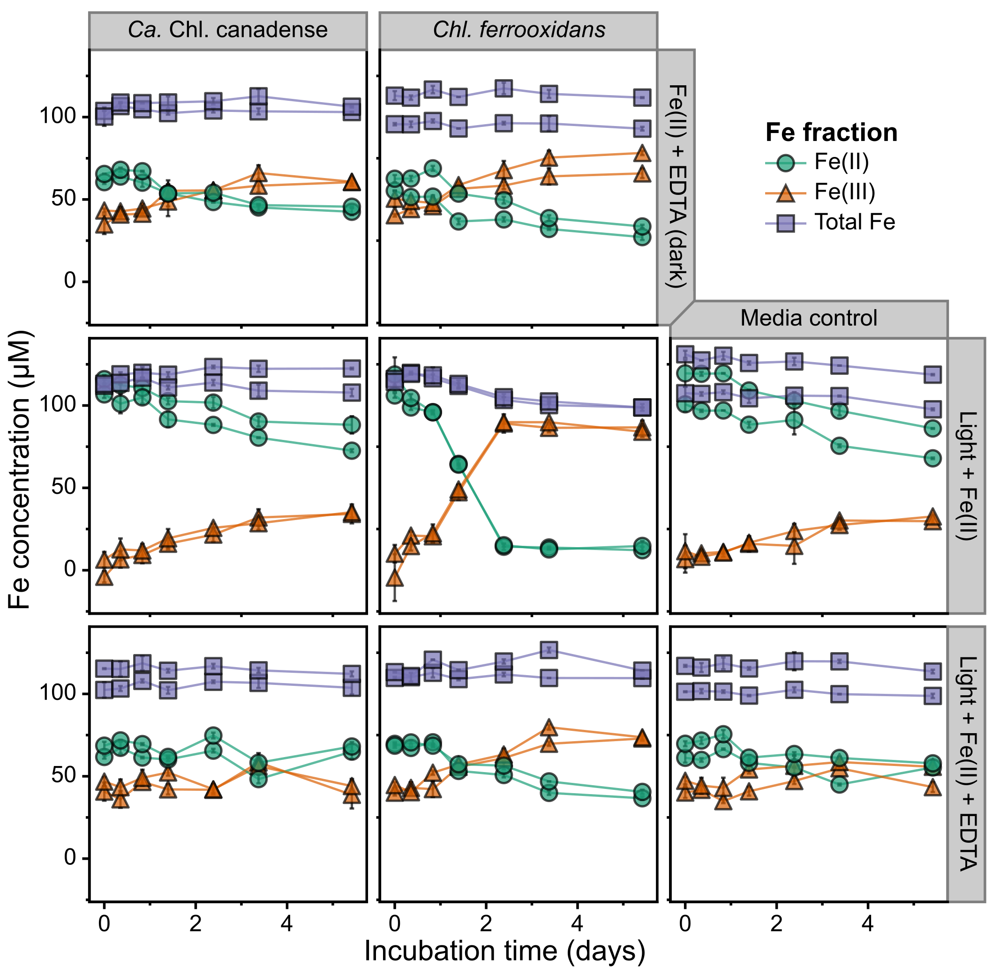

# ABOUT Figure 4 - photoferrotropy incubation data
Copyright Jackson M. Tsuji, Neufeld Research Group, 2020  
Part of the larger *IISD-ELA Chlorobia cyc2 project*.

## Define where you downloaded the Github repo:
```bash
github_repo_location="/Analysis/jmtsuji/chlorobia-cyc2-genomics"
```

## 1. Processed raw 96 well plate data
Ferrozine data was read in 96 well plate format. A custom R script was made to process this data into more human-usable iron concentrations.

Installed the 96-well-spec-analysis script, commit c58ab98
```bash
install_dir="${github_repo_location}/Figure_04_photoferrotrophy_incubation/input_data"

cd "${install_dir}"
git clone https://github.com/jmtsuji/96-well-spec-analysis.git
cd 96-well-spec-analysis
git checkout c58ab98
```
Dependency R packages were also installed.

Ran the script independently for each time point, using the metadata files supplied in this Github repo:
```bash
work_dir="${github_repo_location}/Figure_04_photoferrotrophy_incubation/input_data"
script_dir="${work_dir}/96-well-spec-analysis"

cd "${work_dir}"

"${script_dir}/96_well_spec_analysis.R" --spec_file 191121_measurement/191121_Chl1_photoferrotrophy_tU_t0_t1_t2_FeTot.txt --metadata_file 191121_measurement/191121_Chl1_photoferrotrophy_tU_t0_t1_t2_FeTot_metadata_vs3.tsv --run_name 191121_measurement/191121_analyzed/191121_FeZ

"${script_dir}/96_well_spec_analysis.R" --spec_file 191122_measurement/191122_Chl1_photoferrotrophy_t3_t4_final.txt --metadata_file 191122_measurement/191122_Chl1_photoferrotrophy_t3_t4_final_metadata_vs2.tsv --run_name 191122_measurement/analyzed/191122_FeZ 2>&1 | tee 191122_measurement/analyzed/191122_FeZ.log

"${script_dir}/96_well_spec_analysis.R" --spec_file 191125_measurement/191125_Chl1_photoferrotrophy_t5_t6_final.txt --metadata_file 191125_measurement/191125_Chl1_photoferrotrophy_t5_t6_final_metadata_vs2.tsv --run_name 191125_measurement/analyzed/191125_FeZ 2>&1 | tee 191125_measurement/analyzed/191125_FeZ.log

"${script_dir}/96_well_spec_analysis.R" --spec_file 191129_measurement/191129_Chl1_photoferrotrophy_t7_final.txt --metadata_file 191129_measurement/191129_Chl1_photoferrotrophy_t7_final_metadata_vs2.tsv --run_name 191129_measurement/analyzed/191129_FeZ 2>&1 | tee 191129_measurement/analyzed/191129_FeZ.log

"${script_dir}/96_well_spec_analysis.R" --spec_file 191212_measurement/191212_Chl1_photoferrotrophy_t8_t9_final.txt --metadata_file 191212_measurement/191212_Chl1_photoferrotrophy_t8_t9_final_metadata_vs2.tsv --run_name 191212_measurement/analyzed/191212_FeZ 2>&1 | tee 191212_measurement/analyzed/191212_FeZ.log
```

Pasted together the `*_unknowns.tsv` files (from 191121 until 191125) into a single TSV file in the `summary` folder, `Fe_incubation_plotting_data_191125_Fig_4.tsv`. Also pasted together all of the above `*_unknowns.tsv` files (from 191121 until 191212) into another TSV file in the `summary` folder, `Fe_incubation_plotting_data_191212_Fig_S9.tsv`, which will be used for Supplementary Figure 9.

## 2. Plotted the figure
Along with the `Fe_incubation_plotting_data_191125_Fig_4.tsv` data file in `input_data/summary`, used the following metadata files in the `plot` folder to guide plotting:
- `sample_metadata.tsv` - information about each bottle run in the experiment
- `timepoint_metadata.tsv` - information about each experiment time point

Ran `plot/Figure_04_plotter.ipynb` in a Jupyter notebook (using Python 3) to produce `plot/Figure_04_raw.pdf` (note: "Ca. Chl. canadense" is accidentally named "Ca. Chl. borealis" here). Note that you'll need to install all libraries loaded at the top of the script. After running the script, I then cleaned up the raw figure in Inkscape to make `plot/Figure_04_cleaned.pdf`, the final figure.

This results in the following figure:


