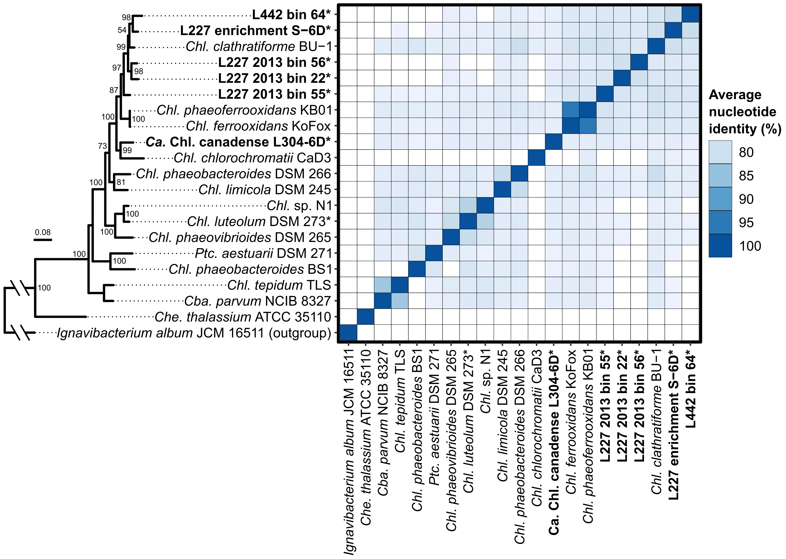

# ABOUT Supplementary Figure S1 - average nucleotide identity among *Chlorobia*
Copyright Jackson M. Tsuji, Neufeld Research Group, 2019
Part of the larger *IISD-ELA Chlorobia cyc2 project*.

## 1. Data collection
The `input_files` directory contains the data used to create the plot:
- `Chlorobia_FastANI_results.txt` - output table from running FastANI against all *Chlorobia* genomes. Generated in `Data_analysis_pipeline/06_comparative_genomics/06_ANI`.
- `chlorobia_riboprotein_phylogeny.treefile` - concatenated ribosomal protein phylogeny of the *Chlorobia*, generated in `Data_analysis_pipeline/06_comparative_genomics/03_chlorobia_phylogeny`
- `Chlorobia_naming_info.tsv` - guide file linking the names of the *Chlorobia* in the FastANI analysis to corresponding names in the phylogeny. Also includes the final plotting name.

## 2. Plotting
Ran `plot/Figure_S1_plotter.R` in interactive mode (e.g., in RStudio) to produce `plot/Figure_S1_raw.pdf`. Note that you'll need to install all libraries loaded at the top of the script. After running the script, I then cleaned up the raw figure in Inkscape to make `plot/Figure_03_cleaned.pdf`.

This results in the following figure:


See R package versions in `R_session_info.log`. Log was generated after running the above script by:
```R
sink("R_session_info.log")
sessionInfo()
sink()
```

