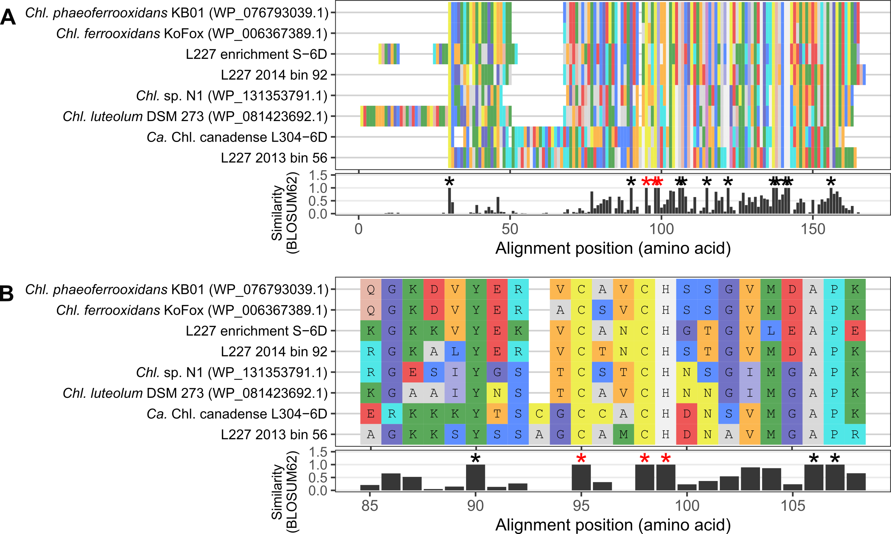

# ABOUT Supplementary Figure 2 - *c5* family cytochrome gene alignment
Copyright Jackson M. Tsuji, Neufeld Research Group, 2020  
Part of the larger *IISD-ELA Chlorobia cyc2 project*.

This figure is composed of two panels that were produced separately and then combined in Inkscape.

## Panel A - full sequence alignment
This plot was mostly automated.

### 1. Input files
The `input_data` directory in `panel_A` contains the data used to create the plot:
- `c5_family_Chlorobia_aligned.faa` - unmasked alignment of the primary sequences of *c5* family cytochromes adjacent to *cyc2* in the *Chlorobia* genomes
- `c5_plotting_name_info.tsv` - guide file for the final names to be used in the plot
- `residue_colours_rasmol.tsv` - guide file for amino acid colours. I used a colour scheme widely availble online attributed to [RasMol](http://www.openrasmol.org/doc/), an open-source molecular visualization tool. Thanks, RasMol.

### 2. Plotted the figure
Ran `plot/Figure_S2A_plotter.R` in interactive mode (e.g., in RStudio) to produce `plot/Figure_S2A_raw.pdf`. Note that you'll need to install all libraries loaded at the top of the script.

See R package versions in `R_session_info.log`. Log was generated after running the above script by:
```R
sink("R_session_info.log")
sessionInfo()
sink()
```

## Panel B - subset sequence alignment
This plot was mostly automated and is similar to Panel A.

### 1. Input files
The `input_data` directory in `panel_B` contains the data used to create the plot -- identical files as in the `panel_A` folder above.

### 2. Plotted the figure
Ran `plot/Figure_S2B_plotter.R` in interactive mode (e.g., in RStudio) to produce `plot/Figure_S2B_raw.pdf`. Note that you'll need to install all libraries loaded at the top of the script.

See R package versions in `R_session_info.log`. Log was generated after running the above script by:
```R
sink("R_session_info.log")
sessionInfo()
sink()
```

## Final figure
Each panel was combined to produce Supplementary Figure S2:

