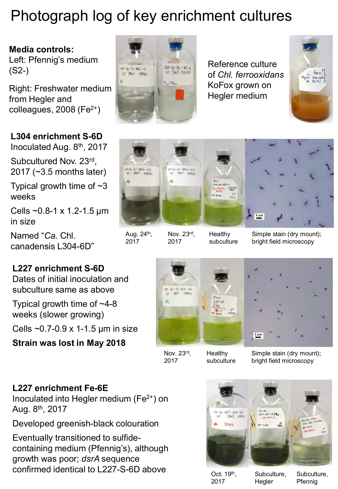

# ABOUT Supplementary Figure S2 - enrichment culturing log
Copyright Jackson M. Tsuji, Neufeld Research Group, 2019
Part of the larger *IISD-ELA Chlorobia cyc2 project*.

This folder contains the raw photos used to make the enrichment culturing summary sheet in Figure S2 in the paper:
- `controls`: photos of control cultures/media
- `L227_Fe_6E`, `L227_S_6D`, `L304_S_6D`: photos of these respective enrichment cultures. The date code in filenames is `yyyy-mm-dd` and refers to the date when the photo was taken.
- `microscopy` - dry mount (simple stain) microscopy images of the cultures. Same date code system as above.

The folder also includes some **bonus data** referred to in the paper:
- `dsrA_seq`: contains the cleaned Sanger sequencing data for amplified _dsrA_ sequences from L227_S_6D and L227_Fe_6E. As referred to in the paper, the sequences are identical (not counting different start/end points due to sequencing quality) with the exception of a single ambiguous base ("K") in L227_Fe_6E.

Final figure (`Figure_S2`) is included in PowerPoint, PDF, and JPEG formats:

