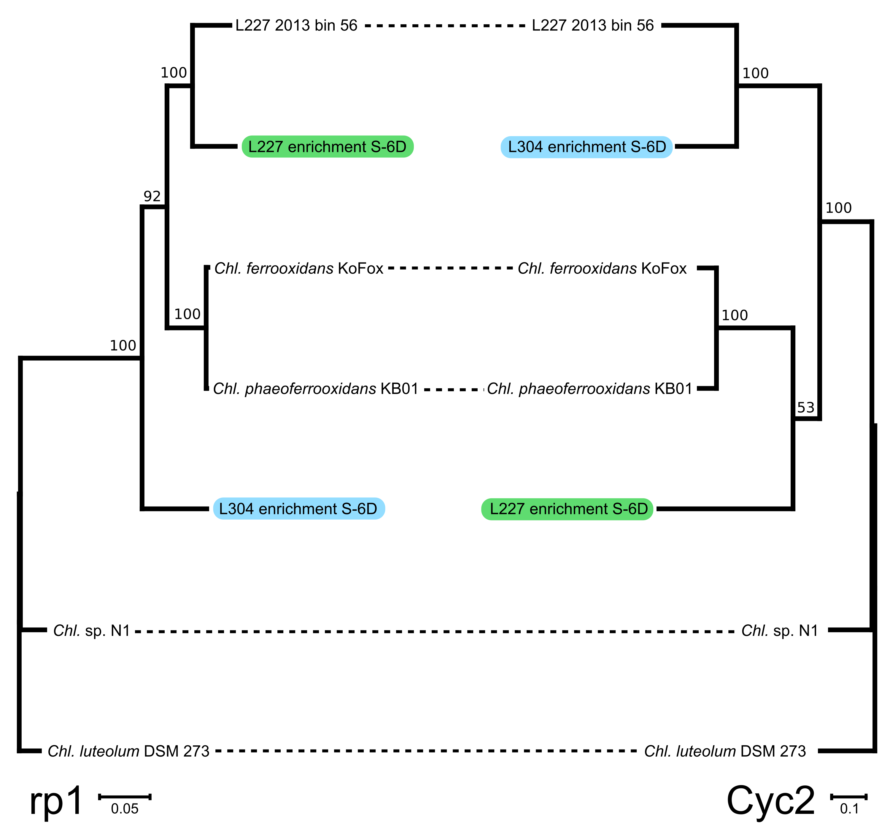

# ABOUT Figure S3 - comparison of *cyc2* vs riboprotein-based phylogeny in *Chlorobia*
Copyright Jackson M. Tsuji, Neufeld Research Group, 2019  
Part of the larger *IISD-ELA Chlorobia cyc2 project*.

## 1. Data collection
The `input_files` directory contains the data used to create the plot:
- `cyc2_subset_phylogeny.treefile` - phylogeny of *cyc2* from *Chlorobia* which have corresponding good quality genomes. Produced in `Data_analysis_pipeline/06_comparative_genomics/04_subset_phylogenies/cyc2`.
- `riboprotein_subset_phylogeny.treefile` - phylogeny for the genomes of the same *Chlorobia*. Produced in `Data_analysis_pipeline/06_comparative_genomics/04_subset_phylogenies/riboprotein`. 

## 2. Plotting the phylogeny
No code this time. I opened both trees in Dendroscope `v3.5.9` and made a tanglegram according to their instructions. I then saved the tanglegram as a SVG (`Figure_S4_raw.svg`), which I subsequently touched up in Inkscape to produce `Figure_S3_cleaned.pdf`, the final version of the figure:

