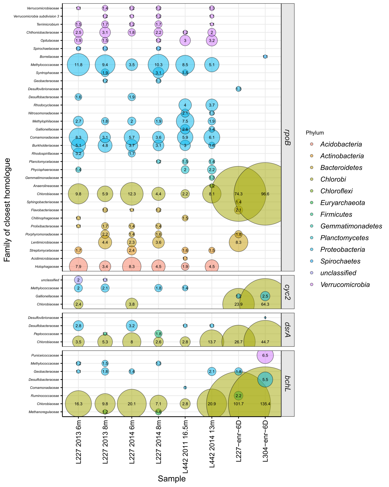

# ABOUT Supplementary Figure 4 - unassembled read profiling of taxonomic/functional genes
Copyright Jackson M. Tsuji, Neufeld Research Group, 2019  
Part of the larger *IISD-ELA Chlorobia cyc2 project*.

This figure was build as a validation for Figure 3. Figure 3 relies on read mapping to genomic bins. For Figure S4, meanwhile, unassembled reads were scanned directly using HMMs, and taxonomic affiliations of each hit were determined (via MetAnnotate). The correspondance between the data in Figures 3 and S4 are fairly reasonable (within ~2x; see the manuscript text), implying that the methods are fairly robist.

## 1. Data collection
The `input_files` directory contains the data used to create the plot:
- `hmm_info.tsv` - guide file specifying which HMM hits are to be plotted, their length (for normalization), and the plotting names of the HMMs
- `dataset_info.tsv` - guide file specifying which metagenomes are to be plotted and their plotting names

In addition, the following files must be downloaded from the Zenodo data repository (code below):
- `metannotate_annotations_unassembled_reads.tsv.gz` - the MetAnnotate annotations generated in `Data_analysis_pipeline/05_bin_analysis/03_metannotate/output_raw_reads`

Download code:
```bash
# Define where you downloaded the Github repo on your local machine
github_repo_location="/Analysis/jmtsuji/chlorobia-cyc2-genomics"

# Here is where the additonal files will be downloaded to
download_dir="${github_repo_location}/Figure_S4_environmental_abundances_raw_reads/input_data"

# Download the files
zenodo_url="https://zenodo.org/record/3228469/files/metannotate_annotations_unassembled_reads.tsv.gz"
cd ${download_dir}
wget ${zenodo_url}

# Downloads 'metannotate_annotations_unassembled_reads.tsv.gz'
# Can work with the zipped file directly.
```

## 2. Plotting the figure
Ran `plot/Figure_S4_plotter.R` in interactive mode (e.g., in RStudio) to produce `plot/Figure_S4.pdf`. Note that you'll need to install all libraries loaded at the top of the script and the sourced MetAnnotate processing script. No post-processing was done - the raw PDF output was used as-is.

This results in the following figure:


The script also generates a couple supplementary files also in the `plot` folder:
- `Figure_S4_plotting_data.tsv` - tabular summary of the data plotted
- `Figure_S4_0.5percent_for_reference.pdf` - same figure but showing all families >= 0.5% normalized relative abundance instead of >= 1% normalized relative abundance. This shows more taxa but is a messier figure. For reference only.
- `Figure_S4_0.5percent_for_reference_plotting_data.tsv` - accompanying data for `Figure_S4_0.5percent_for_reference.pdf`

See R package versions in `R_session_info.log`. Log was generated after running the above script by:
```R
sink("R_session_info.log")
sessionInfo()
sink()
```

