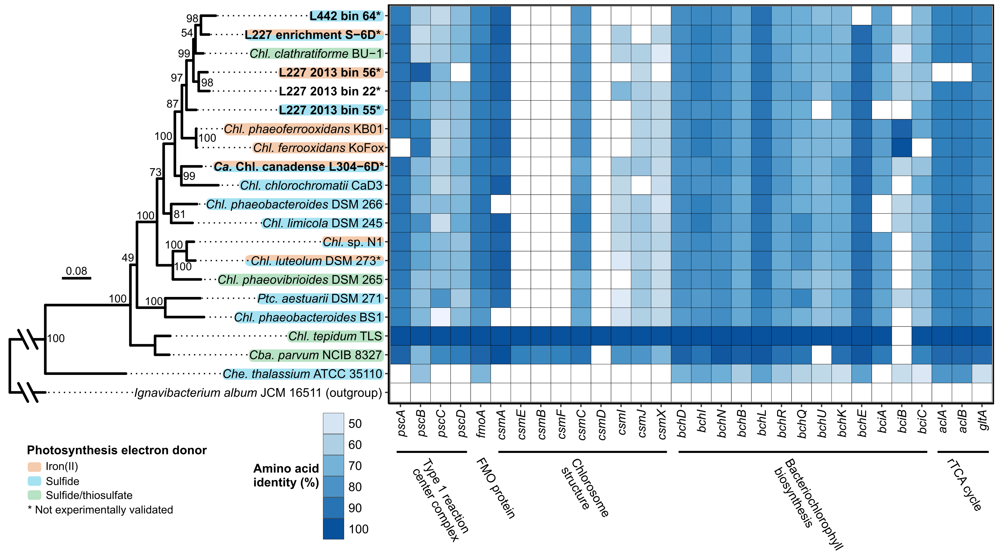

# ABOUT Figure S5 - photosynthesis/C fixation gene pathways among *Chlorobia*
Copyright Jackson M. Tsuji, Neufeld Research Group, 2020  
Part of the larger *IISD-ELA Chlorobia cyc2 project*.

The raw version of this plot was generated automatically using the BackBLAST pipeline (see `Data_analysis_pipeline/06_comparative_genomics/05_pathway_analysis/02_photosynthesis_C_fixation_genes`) and is included here as `Figure_S5_raw.pdf`.

I then cleaned up the raw figure in Inkscape to make `Figure_S5_cleaned.pdf`, the final figure:  

