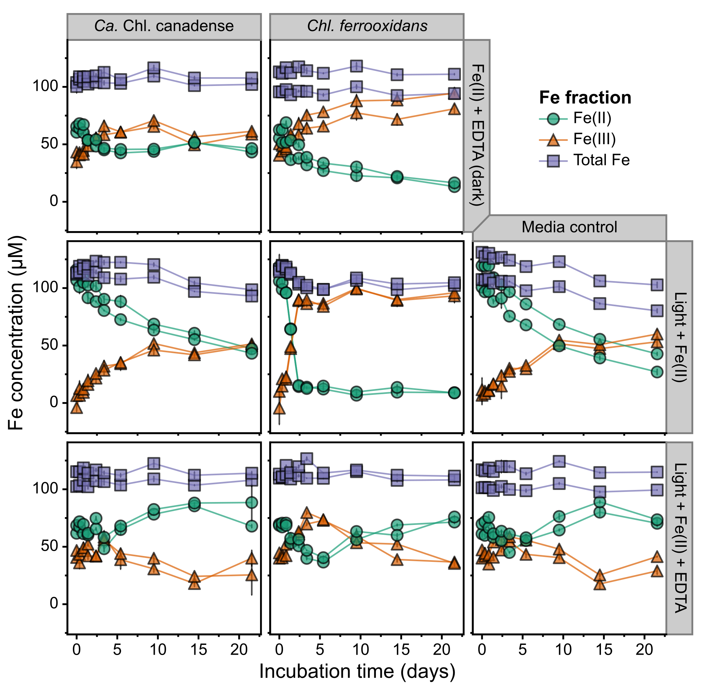

# ABOUT Supplementary Figure S7 - photoferrotropy incubation data, extended version
Copyright Jackson M. Tsuji, Neufeld Research Group, 2019  
Part of the larger *IISD-ELA Chlorobia cyc2 project*.

## Define where you downloaded the Github repo:
```bash
github_repo_location="/Analysis/jmtsuji/chlorobia-cyc2-genomics"
```

## 1. Processed raw 96 well plate data
Ferrozine data was read in 96 well plate format. A custom R script was made to process this data into more human-usable iron concentrations. 
See the code and raw data for this in `Figure_04_photoferrotrophy_incubation`. 
A copy of the final summary file is provided in the Figure S7 folder in `input_data/summary/Fe_incubation_plotting_data_191212_Fig_S7.tsv`.

## 2. Plotted the figure
Along with the `Fe_incubation_plotting_data_191212_Fig_S7.tsv` data file in `input_data/summary`, used the following metadata files in the `plot` folder to guide plotting:
- `sample_metadata.tsv` - information about each bottle run in the experiment
- `timepoint_metadata.tsv` - information about each experiment time point

Ran `plot/Figure_S7_plotter.ipynb` in a Jupyter notebook (using Python 3) to produce `plot/Figure_S7_raw.pdf` (note: "Ca. Chl. canadense" is accidentally named "Ca. Chl. borealis" here). Note that you'll need to install all libraries loaded at the top of the script. After running the script, I then cleaned up the raw figure in Inkscape to make `plot/Figure_S6_cleaned.pdf`, the final figure.

This results in the following figure:


