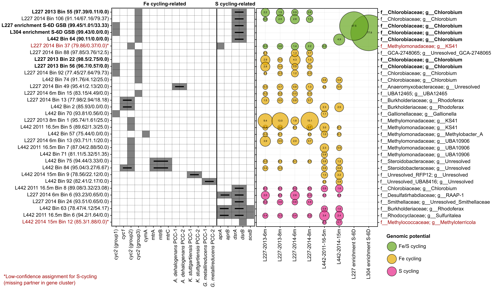

# ABOUT Supplementary Figure S8 - additional iron/sulfur cycling genes among genome bins from this study
Copyright Jackson M. Tsuji, Neufeld Research Group, 2020  
Part of the larger *IISD-ELA Chlorobia cyc2 project*.

## 1. Data collection
The `input_files` directory contains the data used to create the plot:
- `FeGenie-geneSummary.csv` - FeGenie search results - generated as desribed in `Data_analysis_pipeline/05_bin_analysis/README.md`
- `S_cycling_hmm_search_results_raw.tsv` - search results for S-cycling genes via hmmsearch - see the same README file as above

In addition to the files above, used the following metadata files in the `plot` folder to guide plotting:
- `fegenie_naming.tsv` - information about each bottle run in the experiment
- `S_cycling_hmm_naming.tsv` - information about each experiment time point

## 2. Plotted the figure
Ran `plot/Figure_S8_plotter.ipynb` in a Jupyter notebook (using Python 3) to produce `plot/Figure_S8a_raw.pdf` and `plot/Figure_S8b_raw.pdf`. Note that you'll need to install all libraries loaded at the top of the script. After running the script, I then cleaned up the raw figures in Inkscape and pasted them together to make `plot/Figure_S8_cleaned.pdf`, the final figure.

This results in the following figure:

